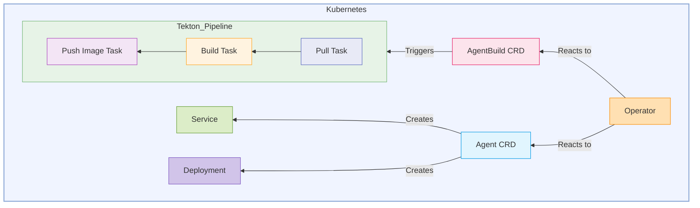

# Kubernetes Operator for BeeAI Agent Management and Build Automation 

## 1. Proposal

This document presents a proposal for a Kubernetes Operator to automate the lifecycle management of BeeAI agents within a Kubernetes cluster. This operator will manage two Custom Resources (CRs): `Agent` and `AgentBuild`.

The `Agent` CR defines the desired state of a BeeAI agent, including its container image, environment variables, and resource requirements. The operator will reconcile `Agent` resources by ensuring a corresponding Kubernetes Deployment and Service exist with the specified configurations.

The `AgentBuild` CR defines the specifications for building and publishing a container image for a BeeAI agent. Upon creation or update of an `AgentBuild` resource, the operator will trigger a Tekton pipeline to automate pulling source code, building a Docker image, and pushing it to a specified image registry. Secure access to private repositories is managed through a reference to a Kubernetes Secret containing a GitHub token. 

## 2. Goals

* Automate the creation and management of Kubernetes Deployments and Services based on `Agent` CR specifications for BeeAI agents.
* Provide a declarative way to define and manage BeeAI agents.
* Automate the container image building and publishing process for BeeAI agents triggered by `AgentBuild` CRs.
* Integrate with Tekton Pipelines for the image building workflow, consisting of pull, build, and push tasks.
* Securely manage GitHub repository access using a referenced Kubernetes Secret.

## 3. Proposed Design



### 4.0. Custom Resource Definitions (CRDs)

* **`Agent` CR :**
    * Defines the desired state of a BeeAI agent.
      
        ```yaml
        apiVersion: beeai.dev/v1
        kind: Agent
        metadata:
          name: sample-agent
        spec:
          description: "A sample BeeAI agent for demonstration"
          image: "ghcr.io/beeai/agents/hello-world-agent:v1"
          env:
            - name: LLM_MODEL
              value: "llama3.2:1b-instruct-fp16"
            - name: LLM_URL
              value: "http://localhost:11434"
          resources:
            limits:
              cpu: "1"
              memory: "2Gi"
            requests:
              cpu: "500m"
              memory: "1Gi"
        ```

* **`AgentBuild` CR :**
    * Defines the specifications for building a container image for a BeeAI agent, referencing an existing Secret for GitHub token.
      
        ```yaml
        apiVersion: beeai.dev/v1
        kind: AgentBuild
        metadata:
          name: my-beeai-agent-build-v1
        spec:
          repoUrl: "https://github.com/johndoe/my-agent-repo.git"
          revision: "main"
          image: hello-world-agent
          imageTag: v1
          imageRegistry: "ghcr.io/beeai/agents" # Registry to push the built image
          env:
             - name: GITHUB_TOKEN
               valueFrom:
                  secretKeyRef:
                     name: github-token-secret
                     key: token
        ```
### 4.1. Operator Components 

* **`Agent` Controller:**
    * Responsible for managing Deployments and Services based on `Agent` CRs.

* **`AgentBuild` Controller:**
    * Responsible for triggering Tekton `PipelineRun` using parameters define in `AgentBuild` CR.

### 4.2. Tekton Pipeline Definition

The operator will generate a Tekton `PipelineRun` that will be triggered by the `AgentBuild` controller.

* **Pull Task:**
    * **Input:** `repoUrl`, `revision`, **GitHub Token (via Tekton Secret sourced from `secretRef`)**.
    * **Action:** Clones the Git repository specified by `repoUrl` at the specified `revision` into a shared workspace. The GitHub token will be used for authentication, likely by mounting a Tekton Secret (populated from the Kubernetes Secret referenced by `secretRef`) and configuring Git credentials within the Task.
    * **Output:** Source code in the workspace.

* **Build Task:**
    * **Input:** Source code workspace, `imageName` (full name including registry and tag).
    * **Action:** Builds a Docker image for the BeeAI agent using a `Dockerfile` found in the source code workspace. The image will be tagged with the provided `imageName` using a tool like `kaniko`.
    * **Output:** Built Docker image (implicitly available for the next task).

* **Push Task:**
    * **Input:** Built Docker image, `imageName`.
    * **Action:** Pushes the built Docker image to the registry specified in the `imageName`. This task will require appropriate credentials to authenticate with the registry 

## 5. Implementation Details
  * **Programming Language:** Go
  * **Operator Scaffolding:** Kubebuilder will be used for project initialization  
