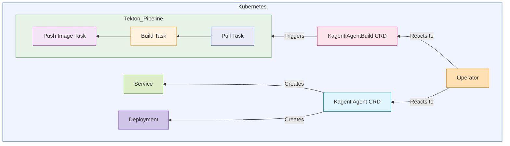

# Kagenti Operator
This document presents a proposal for a Kubernetes Operator to automate the lifecycle management of AI agents within a Kubernetes cluster. This operator will manage two Custom Resources (CRs): `KagentiAgent` and `KagentiAgentBuild`.

The `KagentiAgent` CR defines the desired state of a AI agent, including its container image, environment variables, and resource requirements. The operator will reconcile `KagentiAgent` resources by ensuring a corresponding Kubernetes Deployment and Service exist with the specified configurations.

The `KagentiAgentBuild` CR defines the specifications for building and publishing a container image for a AI agent. Upon creation or update of an `KagentiAgentBuild` resource, the operator will trigger a Tekton pipeline to automate pulling source code, building a Docker image, and pushing it to a specified image registry. Secure access to private repositories is managed through a reference to a Kubernetes Secret containing a GitHub token. Once the build finishes, the controller reconcilling `KagentiAgentBuild` CR will create `KagentiAgent` CustomResource.

## 2. Goals

* Automate the creation and management of Kubernetes Deployments and Services based on `KagentiAgent` CR specifications for AI agents.
* Provide a declarative way to define and manage AI agents.
* Automate the container image building and publishing process for BeeAI agents triggered by `KagentiAgentBuild` CRs.
* Integrate with Tekton Pipelines for the image building workflow, consisting of pull, build, and push tasks.
* Securely manage GitHub repository access using a referenced Kubernetes Secret.
* Lock down agent pods with read-only filesystem

## 3. Proposed Design

## License

Copyright 2025.

Licensed under the Apache License, Version 2.0 (the "License");
you may not use this file except in compliance with the License.
You may obtain a copy of the License at

    http://www.apache.org/licenses/LICENSE-2.0

Unless required by applicable law or agreed to in writing, software
distributed under the License is distributed on an "AS IS" BASIS,
WITHOUT WARRANTIES OR CONDITIONS OF ANY KIND, either express or implied.
See the License for the specific language governing permissions and
limitations under the License.

