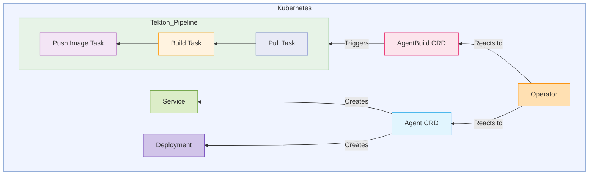

## Kagenti Operator ##

The `Kagenti Operator` is a Kubernetes operator that manages AI Agent lifecycle supporting deployments from existing images or from source code. 

### Architecture ###

The operator is designed with two Custom Resources (CRs) to seperate build concerns from deployment concerns: 
 - **Agent CR** Manages the deployment and lifecycle of AI Agents using container images
 - **AgentBuild CR** Manages the build phase, orchestrating Tekton Pipelines to build container images from source 

### Documentation ###
- [Design](docs/operator.md)
- API Reference
- Installation Guide
- User Guide