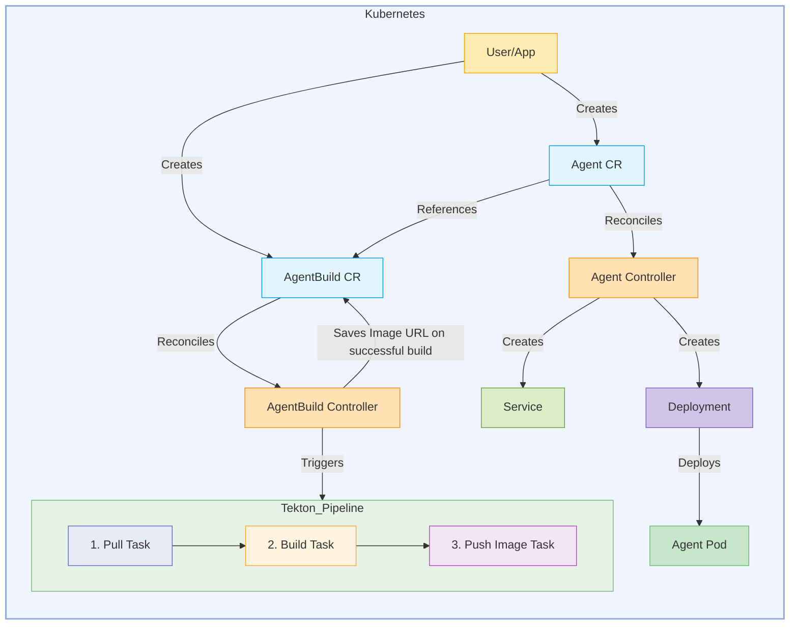
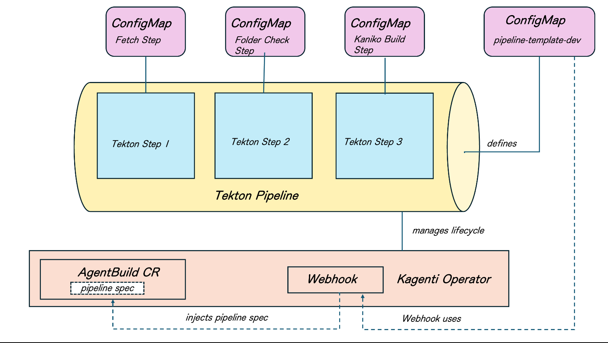

# Kagenti Operator

This document presents a proposal for a Kubernetes Operator to automate the lifecycle management of AI agents within a Kubernetes cluster. This operator will manage two Custom Resources (CRs): `Agent` and `AgentBuild`.

The `Agent` CR defines the desired state of a AI agent, including its container image, environment variables, and resource requirements. The operator will reconcile `Agent` resources by ensuring a corresponding Kubernetes Deployment and Service exist with the specified configurations.

The `AgentBuild` CR defines the specifications for building and publishing a container image for a AI agent. Upon creation or update of an `AgentBuild` resource, the operator will trigger a Tekton pipeline to automate pulling source code, building a Docker image, and pushing it to a specified image registry. Secure access to private repositories is managed through a reference to a Kubernetes Secret containing a GitHub token.

## Goals

* Automate the creation and management of Kubernetes Deployments and Services based on `Agent` CR specifications for AI agents
* Support deployment of AI Agents from existing container images or from source code in Github
* Automate the container image building and publishing process for AI agents triggered by `AgentBuild` CRs.
* Integrate with Tekton Pipelines for the image building workflow, consisting of pull, build, and push tasks.
* Securely manage GitHub repository access using a referenced Kubernetes Secret.
* Lock down agent pods with read-only filesystem with minimal privileges
* Support cluster-wide as well as namespaced scope deployment

## Deployment Modes

The kagenti operator supports both cluster-wide and namespaced deployment modes. In cluster-wide, it uses ClusterRoleBinding to watch and reconcile resources across all namespaces. For stricter isolation, it can run in namespaced scope using RoleBinding in specific namespaces, allowing the operator to only manage resources in explicitly authorized namespaces while maintaining least-privilege access controls.

## Proposed Design



## Kagenti Build From Source Process Overview

The Kagenti Operator implements a flexible, template-based build system that leverages Tekton pipelines to build containerized applications from source code. The system is designed to provide both simplicity for common use cases and flexibility for advanced scenarios.

### Pipeline Template Architecture



### Build Execution Flow

The complete lifecycle follows this orchestrated pattern:

1. `AgentBuild CR Creation`: User/App creates AgentBuild CustomResource in Kubernetes

2. `Webhook Processing`

* Validates pipeline parameters.

* Injects appropriate pipeline template based on defined environment (dev, dev-external, preprod, prod) defined in AgentBuild CR.

3. `Build Execution`

* agentbuild_controller retrieves individual step specifications from ConfigMaps
* Creates a Tekton Pipeline resources from injected template.
* Merges user parameters with step defaults.
* Launches PipelineRun with proper configuration.
* Monitors build progress and updates AgentBuild CR status.
* On succesful container image push, the agentbuild_controller records container image URL in the AgentBuild CR status

### Template-Based Pipelines

The operator comes with a ready-to-use build template that automatically creates Docker images from your GitHub source code. This template is stored in a ConfigMap and is automatically installed when you set up the operator.

`How Pipeline Selection Works`: The operator chooses which pipeline to use based on a simple mode setting in your AgentBuild CR configuration:

Set mode: dev → Uses basic build pipeline for development using internal registry (available)

Set mode: dev-external → Uses basic build pipeline for development using external image registry (available)

Set mode: preprod → Adds security scanning (coming soon)

Set mode: prod → Includes security, testing, and compliance (coming soon)

If you don’t specify a mode, the operator defaults to dev.

### Built-in Pipeline Template

The default dev pipeline runs these Tekton steps:

Clone - Downloads your code from GitHub

Verify - Checks that the code structure is correct

Build - Creates a Docker image from your source code

This system lets you use simple development builds while you’re coding, then can automatically get more rigorous security and quality checks when you’re ready to deploy to production environments.

### Individual Tekton Step Storage

Each pipeline step is stored as a separate ConfigMap containing:

* task-spec.yaml - Complete Tekton TaskSpec definition.
* Default parameter values for the step.
* Step-specific logic and container specifications.

### Parameter Override System

Users specify their build configuration in a AgentBuild CR by providing parameters that override template defaults:

```yaml

pipeline:
  mode: "dev"  # Selects pipeline-template-dev
  parameters:
    - name: "repo-url"
      value: "github.com/myorg/myapp.git"
    - name: "image"
      value: "registry.example.com/myapp:v1.0.0"
```

The system automatically merges user-provided parameters with step defaults, allowing users to customize only what they need while leveraging sensible defaults for everything else.

### Custom Pipeline Option

For advanced use cases, users can bypass templates entirely by specifying a custom pipeline:

```yaml

pipeline:
    parameters:
      - name: "repo-url"
        value: "github.com/myorg/myapp.git"
      - name: "IMAGE"
        value: "registry.example.com/myapp:v1.0.0"
    steps:
      - name: "custom-build"
        configMap: "my-custom-build-step"
        enabled: true
      - name: "security-scan"
        configMap: "custom-security-step"
        enabled: true
```

This provides complete flexibility for organizations with specific build requirements.

## License

```bash
Copyright 2025.

Licensed under the Apache License, Version 2.0 (the "License");
you may not use this file except in compliance with the License.
You may obtain a copy of the License at

    http://www.apache.org/licenses/LICENSE-2.0

Unless required by applicable law or agreed to in writing, software
distributed under the License is distributed on an "AS IS" BASIS,
WITHOUT WARRANTIES OR CONDITIONS OF ANY KIND, either express or implied.
See the License for the specific language governing permissions and
limitations under the License.
```