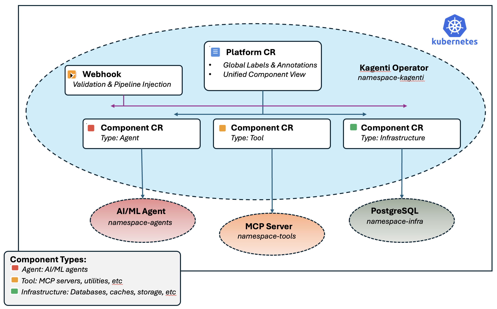

# Kubernetes Operator for Agentic Platform Component Management

A Kubernetes operator designed to deploy and manage multi-component applications, incorporating Tekton build pipelines and lifecycle orchestration.

## Overview

The Platform Operator simplifies the deployment of complex applications by managing collections of components through two key Custom Resources: Platform and Component.

### Component Custom Resource

The Component CR represents the smallest deployable unit within the Kagenti platform. Each Component encapsulates a single application or service along with its deployment configuration, build instructions, and runtime specifications. Components are self-contained entities that can be deployed independently, making them highly modular and reusable across different platforms and environments.

### Platform Custom Resource

The Platform CR provides a unified management layer for collections of Components. Its primary responsibility is applying global labels and annotations to each Component before creation, ensuring consistent metadata across all managed components. The Platform presents a unified view of all components within its scope, aggregating their status, health, and operational metrics into a single coherent interface. This simplified approach allows administrators to monitor entire application ecosystems from a single point of control while maintaining the modularity and independence of individual Components.

## Component Types

Components are categorized into three distinct types based on their functional role:

**Agent** - Represents AI/ML agents

**Tool** - Encompasses utilities, MCP (Model Context Protocol) servers, and supporting services that provide functionality to other components.

**Infrastructure** - Contains foundational services such as databases, caches, message queues, storage systems, and other backend services that provide essential capabilities for the platform.

Each Component CR must specify exactly one type: Agent, Tool, or Infra. The operator will reject any Component that either lacks a type definition or attempts to define multiple types.

## Architecture



## Prerequisites

Before installing the `kagenti-operator`, ensure you have:

* **kubectl:** The Kubernetes command-line tool

* **For building agents:**
  * Agent/Tool source code in a GitHub repository with a working Dockerfile
  * GitHub token for accessing repositories and pushing images to ghcr.io. Currently, the operator has been tested with ghcr.io repo only. Support for alternative image repos will be added soon.

* **For deploying agents:**
  * Existing agent image in a container registry (ghcr.io, Docker Hub, etc.)
  * (Optional) Registry credentials if using private images
  * helm installed

## Quick Start

### Install the Operator

In a new terminal, run:

```shell
curl -sSL https://raw.githubusercontent.com/kagenti/kagenti-operator/main/platform-operator/scripts/install.sh | bash
```

The above installs Kind k8s, local image registry, Tekton Pipeline runtime, Cert Manager, and finally the operator runtime.

### Deployment Process

#### Step 1: Deploy Components First

Apply your Component CRs to define the individual components of your platform. Assuming you have component definitions in a folder named ```components``` do:

```bash
# Apply component definitions
kubectl apply -f components/
```

```Note:``` Components will be created in a suspended state by default and will not deploy until activated by a Platform.

#### Step 2: Deploy Platform

Apply your Platform CR to activate and orchestrate the components. Assuming your platform is defined in ```platform.yaml``` do:

```bash
# Apply platform definition
kubectl apply -f platform.yaml
```

The Platform controller will:

* Apply global labels and annotations to each Component CR

* Automatically lift the suspended flag from referenced components

* Begin the deployment process for all components

#### Step 3: Monitor Deployment

Check the status of your platform and components:

```bash
# Check platform status
kubectl get platforms -n <namespace>

# Check component status
k get components -A

NAMESPACE        NAME              AGE     SUSPEND   READY
kagenti-system   gateway-api       3m16s   false     True
kagenti-system   phoenix           3m16s   false     True
kagenti-system   research-agent    3m16s   false     True
kagenti-system   test-mcp-server   3m16s   false     True

# View detailed status
kubectl describe platform <platform-name> -n <namespace>
```

### Uninstall the Operator

To properly uninstall the Kagenti Platform Operator, you must follow a specific order to ensure all resources are cleaned up correctly.

#### Step 1: Delete Platform Custom Resources

```IMPORTANT:```You must delete Platform CR first, as they manage the lifecycle of Component CRs and related resources.

```bash
# List all Platform resources
kubectl get platforms --all-namespaces

# Delete all Platform resources
kubectl delete platforms --all --all-namespaces

# Wait for Platform resources to be fully deleted
kubectl get platforms --all-namespaces
```

The Platform controller will automatically:

* Delete all related Component CRs

* Clean up child resources (Deployments, Services, ConfigMaps, etc.)

* Remove finalizers once cleanup is complete

#### Step 2: Verify Component Cleanup

After deleting Platforms, verify that Component resources are also cleaned up:

```bash
# Check that all Components are deleted
kubectl get components --all-namespaces

# If any Components remain, delete them manually
kubectl delete components --all --all-namespaces
```

#### Step 3: Uninstall Helm Chart

Once all Platform and Component CRs are deleted, you can safely uninstall the operator:

```bash
# Find the Helm release name
helm list -n kagenti-system

# Uninstall the operator (replace with your actual release name)
helm uninstall agentic-platform-controller-manager-xxx-xxx -n kagenti-system
```

## Component Deployment Strategies

The Kagenti Component resource provides flexible deployment mechanisms to accommodate different application packaging and distribution patterns. Whether you're deploying third-party components with published manifests, custom applications stored in version control, containerized services, or packaged Helm charts, the Component spec supports multiple deployment strategies through its deployer configuration.

**Deploy from Manifest URL**
This option fetches and applies a Kubernetes manifest directly from a web URL. It's ideal for deploying stable releases or official installations where the manifest is hosted remotely. The operator downloads the YAML from the specified URL and applies it to the cluster.

```yaml
apiVersion: kagenti.operator.dev/v1alpha1
kind: Component
metadata:
  name: gateway-api
  namespace: kagenti-system
spec:

  infra:
  ...
  deployer:
    ...
    kubernetes:
      manifest:
        url: https://github.com/kubernetes-sigs/gateway-api/releases/download/v1.1.0/standard-install.yaml
    env:
```

**Deploy from GitHub Repository**
This approach retrieves manifests from a specific file path within a GitHub repository at a given revision. It offers version control integration and is a good choice for deploying custom configurations or components stored in Git repositories. You can specify exact commits, branches, or tags, providing precise control over which version gets deployed.

```yaml
apiVersion: kagenti.operator.dev/v1alpha1
kind: Component
metadata:
  name: phoenix
  namespace: kagenti-system
spec:
  infra:
  ...
  deployer:
    kubernetes:
      manifest:
        github:
           repository: https://github.com/kagenti/kagenti
           path: kagenti/installer/src/resources/phoenix.yaml
           revision: main
    env:
```

**Deploy from Docker Image**
This method creates Kubernetes resources directly from a container image specification rather than pre-written manifests. The operator generates the necessary Deployment and Service objects and applies to the cluster. It's particularly useful for custom applications or when you want the operator to handle the Kubernetes resource creation automatically from container metadata.

```yaml
apiVersion: kagenti.operator.dev/v1alpha1
kind: Component
metadata:
  name: test-mcp-server
  namespace: kagenti-system
spec:
  tool:
  ...
  deployer:
    kubernetes:
      imageSpec:
        image: "test-mcp-server"
        imageTag: "latest"
        imageRegistry: "registry.cr-system.svc.cluster.local:5000"
        imagePullPolicy: "IfNotPresent"
        ...
```

**Deploy from Docker Image using PodTemplateSpec**
The PodTemplateSpec field provides complete control over Pod specification in Kubernetes deployments. When specified, it takes precedence over all other configuration fields except Replicas, enabling advanced deployment scenarios that require full access to Kubernetes Pod capabilities.

```yaml
apiVersion: kagenti.operator.dev/v1alpha1
kind: Component
metadata:
  name: test-mcp-server
  namespace: kagenti-system
spec:
  tool:
  ...
  deployer:
    kubernetes:
      replicas: 2
      podTemplateSpec:
        spec:
          containers:
          - name: tool
            image: test-mcp-server
        ...
```

***Validation Rules***

The following validation rules apply when using PodTemplateSpec:

`Mutual Exclusivity:` Only one of ImageSpec, Manifest, or PodTemplateSpec can be specified

`Field Conflicts:` When PodTemplateSpec is specified, these fields must be omitted:

* ImageSpec
* Resources
* ContainerPorts
* ServicePorts
* ServiceType
* Volumes
* VolumeMounts

`Required Fields:` PodTemplateSpec.spec.containers must contain at least one container

`Allowed Fields:` Only Replicas can be specified alongside PodTemplateSpec

**Deploy from Helm Chart**
This deployment strategy leverages Helm charts from public or private repositories to install complex applications with their dependencies. It's especially powerful for deploying established software packages like databases, monitoring tools, or other infrastructure components that benefit from Helm's templating and configuration management capabilities. You can customize deployments through chart parameters while letting Helm handle the resource orchestration and lifecycle management.

```yaml
apiVersion: kagenti.operator.dev/v1alpha1
kind: Component
metadata:
  name: postgresql
spec:
  infra:
  deployer:
    helm:
      chartName: postgresql
      chartRepoName: bitnami
      chartRepoUrl: https://charts.bitnami.com/bitnami
      releaseName: postgresql
      parameters:
        ...
```

**Deploy via Open Lifecycle Manager (OLM)**
Deployment through the OLM for managing operators and their dependencies. Best suited for deploying operators that require subscription management, automatic updates, and complex dependency resolution. `This deployment option is currently not implemented.`

```yaml
apiVersion: kagenti.operator.dev/v1alpha1
kind: Component
metadata:
  name: mongodb-operator
spec:
  infra:
deployer:
  olm:
    packageName: "mongodb-operator"
    source: certified-operators
    channel: "stable"
    installPlanApproval: "Automatic"
```

## Platform Orchestration and Component Activation

The Platform controller serves as the orchestration layer that manages the lifecycle and metadata of Component resources. When a Component is applied to the cluster, the Kagenti operator webhook automatically adds a `suspend: true` flag to prevent immediate deployment.

The Platform controller is responsible for:

**Global Metadata Management:** Applying consistent labels and annotations across all managed Components to ensure uniform identification and organization within the cluster.

**Pipeline Injection:** Optionally injecting build pipeline specifications into Components that require automated build processes before deployment. The injection of the pipeline is triggered by the presence of ```build:``` in the spec part of the Component CR.

**Lifecycle Orchestration:** Removing the ```suspend: true``` flag only after all global metadata has been applied and any required pipeline configurations are in place, allowing the Component to proceed with its deployment strategy.

**Unified Management View:** Providing a centralized interface to monitor and manage collections of related Components as a cohesive application stack.

This approach ensures that Components are deployed in a controlled, consistent manner with proper metadata and build configurations, while maintaining the flexibility of individual Component deployment strategies.

```yaml
apiVersion: kagenti.operator.dev/v1alpha1
kind: Platform
metadata:
  name: ai-development-platform

spec:
  globalConfig:
    namespace: kagenti-system
    annotations:
      kagenti.platform.dev/managed-by: "kagenti-operator"
      kagenti.platform.dev/version: "v1.0.0"
    labels:
      app.kubernetes.io/name: agentic-platform
      team: ai-engineering
      environment: dev

infrastructure:
    - name: phoenix
tools:
    - name: mcp-server-weather
agents:
    - name: research-agent
```

You can find an example of a Platform CR here:  <https://raw.githubusercontent.com/kagenti/kagenti-operator/main/platform-operator/config/samples/platform-example.yaml> and a matching component configuration is here: <https://raw.githubusercontent.com/kagenti/kagenti-operator/main/platform-operator/config/samples/components-example.yaml>

## Build Pipeline System

### Template-Based Pipelines

The operator comes with a ready-to-use build template that automatically creates Docker images from your GitHub source code. This template is stored in a ConfigMap and is automatically installed when you set up the operator.

**How Pipeline Selection Works**
The operator chooses which pipeline to use based on a simple mode setting in your Component configuration:

Set ```mode: dev``` → Uses basic build pipeline for development

Set ```mode: preprod``` → Adds security scanning (coming soon)

Set ```mode: prod``` → Includes security, testing, and compliance (coming soon)

If you don't specify a mode, the operator defaults to ```dev```.

Below is an example Component which requires a build from source:

```yaml
apiVersion: kagenti.operator.dev/v1alpha1
kind: Component
metadata:
  name: test-mcp-server

spec:
  tool:
    build:
      mode: dev   # use operator provided Tekton pipeline
      pipeline:
        parameters:
          - name: repo-url    # your source code repo url
            value: github.com/kagenti/kagenti.git
          - name: revision    # your source code branch
            value: "main"
          - name: subfolder-path  # path to the source to be built
            value: "kagenti/examples/mcp"
          - name: image   # name of the image to build and its repo destination
            value: "registry.cr-system.svc.cluster.local:5000/test-mcp-server:latest"
      cleanupAfterBuild: true
```

**Current Build Pipeline (Development Mode)**
The default dev pipeline runs these Tekton steps:

```Clone``` - Downloads your code from GitHub

```Verify``` - Checks that the code structure is correct

```Build``` - Creates a Docker image from your source code

This system lets you use simple development builds while you're coding, then can automatically get more rigorous security and quality checks when you're ready to deploy to production environments.

You can find the sample steps and template here:  <https://raw.githubusercontent.com/kagenti/kagenti-operator/main/platform-operator/config/samples/tekton>

## Operator Development and Testing

1. Fork the repository and create a new branch
1. Modify the operator code to fit your needs
   * e.g. the code for managing the deployed agents and tools is in [./internal/deployer/kubernetes/kubernetes.go](./internal/deployer/kubernetes/kubernetes.go) file
1. [Install Kagenti](https://github.com/kagenti/kagenti/blob/v0.0.4-alpha.18/docs/demos.md#installation)
1. Uninstall the `kagenti-operator`:

   * ```console
     helm uninstall kagenti-platform-operator -n kagenti-system
     ```

   * Sometimes this removes operator crds. When you get errors about missing crds,
     just install them manually with: `kubectl create -f config/crds/bases/`

1. switch to your new operator branch
1. execute operator cleanup, build, and deployment:

    ```console
     cd kagenti-operator/platform-operator
     ./scripts/cleanup.sh
     make ko-local-build
     make install-local-chart
    ```

1. If you get any errors loading external libraries:

    ```console
     go clean -cache
     go clean -modcache
     go mod tidy
    ```

      Then try the build again
