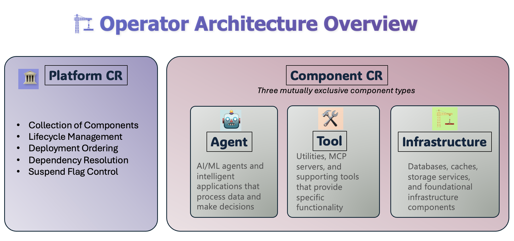
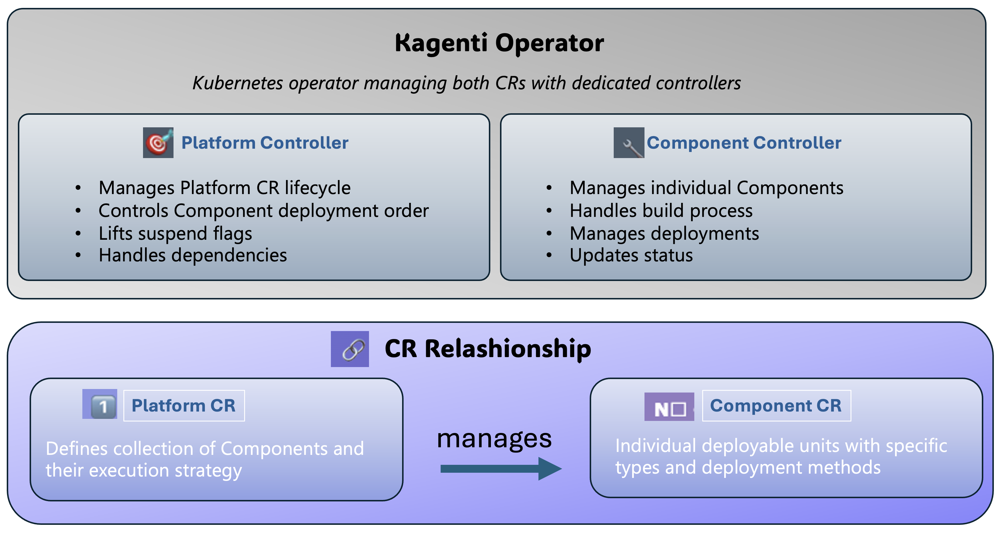
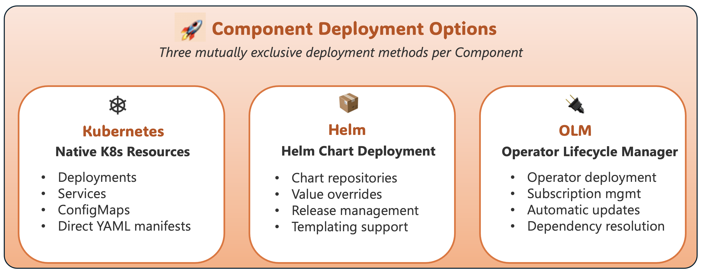

# Kubernetes Operator for Agentic Platform Component Management

A Kubernetes operator designed to deploy and manage multi-component applications, incorporating best-practice build pipelines and seamless lifecycle orchestration.

## Overview
The Platform Operator simplifies the deployment of complex applications by managing collections of components through two key Custom Resources: Platform and Component. It provides automated build processes, dependency management, and deployment orchestration across different environments.

## Key Features

**Multi-Component Application Management**

* Deploy and manage applications composed of multiple interconnected components
* Orchestrate deployment order based on dependencies (still to be implemented)
* Centralized lifecycle management through Platform Custom Resources

**Three Component Types**

* Agent: AI/ML agents
* Tool: Utilities, MCP servers, and supporting services
* Infrastructure: Databases, caches, storage, and foundational services

**Flexible Deployment Options**

* Kubernetes: Native K8s resources (Deployments, Services)
* Helm: Chart-based deployment with value templating
* OLM: Operator Lifecycle Manager for operator deployment (to be implemented)

**Fully Automated Build System**

* Template-based pipelines with mode-specific configurations (dev, preprod, prod)
* Tekton integration for container image builds
* Modular step definitions stored in ConfigMaps for reusability
* Parameter override system for customizing build processes
* Built-in steps: GitHub clone, folder verification, Kaniko builds

**Automated Lifecycle Management**

* Webhook-based 'suspend' mechanism prevents out-of-order component activation
* Platform-controlled orchestration manages component execution order
* Dependency resolution ensures proper deployment sequencing (still to be implemented)
* Status tracking across all components and build processes

## Architecture



## Prerequisites

Before installing the `kagenti-operator`, ensure you have:

* **kubectl:** The Kubernetes command-line tool
* **For building agents:**
  * Agent/Tool source code in a GitHub repository with a working Dockerfile
  * GitHub token for accessing repositories and pushing images to ghcr.io.
* **For deploying agents:**
  * Existing agent image in a container registry (ghcr.io, Docker Hub, etc.)
  * (Optional) Registry credentials if using private images
* **Install [ollama]:**(https://ollama.com/download)


## Quick Start

### 1. Start Ollama
In a new terminal, run:

```shell
ollama run "your-llm-model" --keepalive 60m
```

### 1. Install the Operator
In a new terminal, run:

```shell
curl -sSL https://raw.githubusercontent.com/kagenti/kagenti-operator/main/platform-operator/scripts/install.sh | bash
```

The above installs Kind k8s, Tekton Pipeline CRDs, Cert Manager and its CRDs, and finally the operator runtime with. Part of this is also installation of sample Tekton steps and a template which enable building Docker images from source. You can find the sample steps and template here:  https://raw.githubusercontent.com/kagenti/kagenti-operator/main/platform-operator/config/samples/tekton

### 2. Create a Component object in Kind
Use a sample agent component from the operator samples folder.
```shell
kubectl apply -f https://raw.githubusercontent.com/kagenti/kagenti-operator/main/platform-operator/config/samples/agent-component-with-template.yaml
```

The operator's webhook at this point adds suspend=true and also injects a pipeline spec into the Component's CR. With suspend=true flag, the Component controller will not build nor deploy the Component. To confirm the object state, run:

```shell
 kubectl get component.kagenti.operator.dev/research-agent -n kagenti-system -o yaml
```

In response to the above you should see:

```yaml
apiVersion: kagenti.operator.dev/v1alpha1
kind: Component
metadata:
  creationTimestamp: "2025-06-10T15:06:43Z"
  finalizers:
  - kagenti.operator.dev/finalizer
  generation: 2
  name: research-agent
  namespace: kagenti-system
  resourceVersion: "21313"
  uid: 28065a0d-499f-44da-a464-655459b137be
spec:
  agent:
    build:
      cleanupAfterBuild: true
      mode: dev
      pipeline:
        parameters:
        - name: github-token-secret
          value: github-credentials
        - name: repo-url
          value: github.com/kagenti/agent-examples.git
        - name: revision
          value: main
        - name: subfolder-path
          value: acp/acp_ollama_researcher
        - name: image
          value: registry.cr-system.svc.cluster.local:5000/beai-research-agent:latest
        steps:
        - configMap: github-clone-step
          enabled: true
          name: github-clone
        - configMap: check-subfolder-step
          enabled: true
          name: folder-verification
        - configMap: kaniko-docker-build-step
          enabled: true
          name: kaniko-build
  deployer:
    deployAfterBuild: true
    env:
    - name: HOST
      value: 0.0.0.0
    - name: LLM_API_BASE
      value: http://host.docker.internal:11434/v1
    - name: LLM_API_KEY
      value: dummy
    - name: LLM_MODEL
      value: llama3.2:3b-instruct-fp16
    kubernetes:
      containerPorts:
      - containerPort: 8090
        name: http
        protocol: TCP
      imageSpec:
        image: beai-research-agent
        imagePullPolicy: IfNotPresent
        imageRegistry: registry.cr-system.svc.cluster.local:5000
        imageTag: latest
      resources:
        limits:
          cpu: "1"
          memory: 2Gi
        requests:
          cpu: 500m
          memory: 1Gi
      servicePorts:
      - name: http
        port: 8008
        protocol: TCP
        targetPort: 8090
      serviceType: ClusterIP
    name: my-agent-deployment
    namespace: kagenti-system
  description: A research agent for information gathering
  suspend: true
```

### 3. Create a Platform to Orchestrate Multiple Components
Use a sample Platform from the operator samples folder.
```shell
kubectl apply -f https://raw.githubusercontent.com/kagenti/kagenti-operator/main/platform-operator/config/samples/simple-dev-platform.yaml
```
The operator will lift the suspend flag allowing the k8s Component controller to proceed with the build and Component deployment. At this time you can observe the build process by watching pods in kagent-system namespace as follows:

```shell
watch kubectl get pods -n kagenti-system
```

```shell
Every 2.0s: kubectl get pods 
NAMESPACE                    NAME                                                   READY   STATUS    RESTARTS   AGE
kagenti-system               agentic-platform-controller-manager-57b9795689-c4gjd   1/1     Running   0          111m
kagenti-system               research-agent-7c94bb8b67-rnkr8                        1/1     Running   0          41s

```

## Build Pipeline System

### Template-Based Pipelines

The operator currently includes one built-in pipeline template:

`pipeline-tekton-dev:`Basic clone → verify → build pipeline for development

In the future the two others will be available:

`pipeline-tekton-preprod:` Adds security scanning for pre-production builds

`pipeline-tekton-prod:` Includes compliance checks, testing, and image signing

### Pipeline Configuration (pipeline-template-dev)

```yaml
apiVersion: v1
kind: ConfigMap
metadata:
  name: pipeline-template-dev
  namespace: kagenti-system  
  labels:
    app.kubernetes.io/name: component-operator
    app.kubernetes.io/component: pipeline-template
    component.kagenti.ai/mode: dev
data:
  template.json: |
    {
      "name": "Development Pipeline",
      "namespace": "kagenti-system",      
      "description": "Basic pipeline for development builds",
      "requiredParameters": [
        "repo-url",
        "revision",
        "subfolder-path",
        "image"
      ],
      "steps": [
        {
          "name": "github-clone",
          "configMap": "github-clone-step",
          "enabled": true,
          "description": "Clone source code from GitHub repository",
          "requiredParameters": ["repo-url"]
        },
        {
          "name": "folder-verification",
          "configMap": "check-subfolder-step",
          "enabled": true,
          "description": "Verify that the specified subfolder exists",
          "requiredParameters": ["subfolder-path"]
        },
        {
          "name": "kaniko-build",
          "configMap": "kaniko-docker-build-step",
          "enabled": true,
          "description": "Build container image using Kaniko",
          "requiredParameters": ["image"]
        }
      ],
      "globalParameters": [
        {
          "name": "pipeline-timeout",
          "value": "20m",
          "description": "Overall pipeline timeout"
        }
      ]
    }
```

## Component Types
The Platform Operator supports three distinct component types, each designed for specific application roles and deployment patterns. `Each Component CR must specify exactly one type` - this mutual exclusivity is strictly enforced by the operator's webhook during component creation.

### Agent Components

```yaml
spec:
  agent:
    build: # Build configuration
  deployer: # Deployment method
```
### Tool Components
```yaml
spec:
  tool:
    toolType: "MCP"  # or "Utility"
    build: # Build configuration
  deployer: # Deployment method
```
### Infrastructure Components
```yaml
spec:
  infra:
    infraType: "Database"     # Database, Cache, Queue, etc.
    infraProvider: "PostgreSQL"  # PostgreSQL, Redis, etc.
    version: "13.0"
  deployer: # Deployment method
```

## Deployment Options
The Platform Operator provides three flexible deployment methods to accommodate different application complexity levels and organizational preferences. `Each Component CR must specify exactly one deployment method` - this mutual exclusivity is strictly enforced by the operator's webhook to prevent conflicting deployment configurations.

### Kubernetes Native
Direct deployment using native Kubernetes resources like Deployments and Services. This method provides maximum control and transparency, making it ideal for applications that need fine-grained Kubernetes resource management or custom configurations.

```yaml
deployer:
  kubernetes:
    imageSpec:
      image: "my-app"
      imageTag: "latest"
      imageRegistry: "registry.example.com"
    resources:
      requests:
        cpu: "100m"
        memory: "128Mi"

```

### Helm Charts
Chart-based deployment leveraging the Helm package manager for templating, versioning, and release management. Perfect for applications that benefit from parameterized deployments, version control, or when using existing community charts.
```yaml
deployer:
  helm:
    chartName: "my-chart"
    chartVersion: "1.0.0"
    chartRepoUrl: "https://charts.example.com"
    parameters:
      - name: "image.tag"
        value: "v1.0.0"

```
### Operator Lifecycle Manager (OLM)
Deployment through the Operator Lifecycle Manager for managing operators and their dependencies. Best suited for deploying operators that require subscription management, automatic updates, and complex dependency resolution. This deployment option is currently not implemented. 
```yaml
deployer:
  olm:
    packageName: "my-operator"
    channel: "stable"
    installPlanApproval: "Automatic"

```

## How It Works

1. `Component Creation:` User creates Component CR with build and deployment configuration
2. `Webhook Processing:` Mutating webhook automatically suspends component and injects pipeline template into it.
3. `Platform Orchestration:` Platform controller manages component lifecycle and execution order
4. `Build Execution:` Component controller triggers Tekton pipelines when components are activated
5. `Deployment:` Components are deployed using their specified deployment method
6. `Status Management:` Controllers monitor and update status throughout the lifecycle

## Advanced Features
### Environment-Specific Configuration
* `Development:` Fast iteration with minimal validation
* `Pre-production:` Security scanning and enhanced testing (TBI)
* `Production:` Compliance checks, image signing, and comprehensive validation (TBI)

### Dependency Management (TBI)

* Platform-level dependency resolution
* Automatic component ordering based on dependencies
* Graceful handling of dependency failures


## Implementation Details
* Programming Language: golang
* Operator Scaffolding: Kubebuilder will be used for project initialization