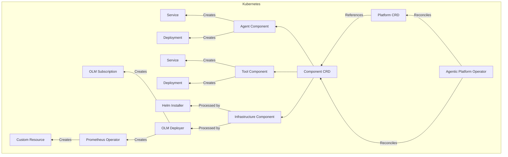

# Kubernetes Operator for Agentic Platform Component Management

## 1. Proposal

This document presents a design for a Kubernetes Operator to automate the lifecycle management of agentic platform components within a Kubernetes cluster. The operator will manage two primary Custom Resources: `Component` CRs and `Platform` CR.

The `Component` CR represents various types of deployable entities including Agents, Tools, and Infrastructure.

The `Platform` CR models the entire platform as a collection of components, managing cross-component dependencies and providing a unified view of the platform's status.

The operator implements controllers for these CRs that handle automated creation, updating, and deletion of underlying Kubernetes resources. It will facilitate building components from source code using Tekton pipelines and deploying these components using various methods such as direct Kubernetes manifests, Helm charts, and the Operator Lifecycle Manager (OLM).


## 2. Goals

* **Unified Management:** Provide a single, consistent way to manage various types of components through a unified `Component` CR.
* **Component Type Support:** Accommodate different component types (Agent, Tool, Infrastructure) with configurations tailored to each type.
* **Automated Resource Management:** Automate the creation and management of underlying Kubernetes resources based on the specifications defined in the `Component` CR.
* **Flexible Deployment:** Support multiple deployment strategies, including Helm charts, direct Kubernetes manifests, and OLM.
* **Tekton Integration:** Seamlessly integrate with Tekton Pipelines for building container images from source code.
* **Dependency Management:** Implement support for defining and managing dependencies between different components.
* **Secure Credential Management:** Securely handle credentials required for accessing source repositories and container image registries.

## 3. Proposed Design

The following diagram illustrates the high-level architecture of the Component Operator:


The architecture diagram illustrates the key components of the system and their interactions:

**Platform CRD:** The central resource definition which models complete platform as collections of components.

**Component CRD:** Represents various deployable entities supporting different component types through a union pattern (Agent, Tool, Infrastructure).

**Component Operator:** The core controller that reconciles Component resources and orchestrates the deployment process.

**Tekton Pipeline:** Manages the build process for components requiring building from source code, consisting of three main tasks:

* **Pull Task:** Clones the specified source repository.
* **Check Subfolder:** Verifies the existence of the designated subfolder within the repository.
* **Build & Push Task:** Builds the container image and pushes it to the specified registry.

The initial design offers a basic, built-in pipeline that automates the essential steps to built images from source code. However, Tekton's true strength lies in its extensibility.  While this default pipeline serves as a convenient starting point, the operator will evolve to accommodate more complex, user-defined Tekton pipelines. This allows for advanced workflows, such as those seen in Red Hat Trusted Application Pipelines, which incorporate practices like creating Bill of Materials (BOM) manifests and performing signed builds to enhance software security.

**Deployment Methods:**
* Direct Kubernetes resources for Agent and Tool components.

* Helm Installer for deploying infrastructure components using Helm charts.

* OLM Deployer for managing infrastructure components through existing operators.


This architecture provides a cohesive approach to managing diverse components while accommodating deployment strategies best suited for each component type.

## 4. Platform Definition

The Platform CR defines the overall composition of an agentic platform, referencing the infrastructure, tools, and agents that make up the platform.

Example:


```yaml
apiVersion: agentic.example.com/v1alpha1
kind: Platform
metadata:
  name: research-platform
spec:
  description: "Research Agentic Platform"

  # Infrastructure components required by the platform
  infrastructure:
    - name: redis-cache-component
      componentReference:
        name: redis
        namespace: redis-system
    - name: postgres-component
      componentReference:
        name: postgresql
        namespace: postgres-system
    - name: prometheus-component
      componentReference:
        name: prometheus
        namespace: prometheus-system
  # Tools required by the platform
  tools:
    - name: mcp-server-component
      componentReference:
        name: mcp-server
        namespace: mcp-system
    - name: dashboard-component
      componentReference:
        name: dashboard
        namespace: agentic-platform

  # Agents that will run on the platform
  agents:
    - name: research-agent-component
      componentReference:
        name: research-agent
        namespace: my-agents
    - name: assistant-agent-component
      componentReference:
        name: assistant-agent
        namespace: my-agents

  # Global configurations that apply to all components
  globalConfig:
    namespace: agentic-platform
    annotations:
      platform.agentic.example.com/version: "1.0.0"
    labels:
      environment: development

status:
```
## 5. Component Types
The Component CRD supports three primary types of components: Agents, Tools, and Infrastructure. Each type has its own specific configuration within the spec field. Only one type can be defined in the Component CR instance. This will be enforced by the k8s validation webhook.

### 5.1 Agent Component
Agent components represent AI agents designed to perform specific tasks within the agentic platform. Each agent can be configured with unique attributes and can be built from source code if necessary.

Example:

```YAML

apiVersion: agentic.platform.dev/v1alpha1
kind: Component
metadata:
  name: research-agent
spec:
  agentComponent:
    buildSpec:
      sourceRepository: "github.com/example/agents.git"
      sourceRevision: "main"
      sourceSubfolder: "research-agent"
      repoUser: "git-user"
      buildOutput:
        image: "research-agent"
        imageTag: "v1.0.0"
        imageRegistry: "ghcr.io/example"

  description: "A research agent for information gathering"

  deployerSpec:
    name: research-agent
    namespace: my-agents
    kubernetes:
      imageSpec:
        image: "research-agent"
        imageTag: "v1.0.0"
        imageRegistry: "ghcr.io/example"
        secret: $(IMAGE_REPO_SECRET)
      resources:
        limits:
          cpu: "1"
          memory: "2Gi"
        requests:
          cpu: "500m"
          memory: "1Gi"
      serviceType: "ClusterIP"

    env:
      - name: LLM_MODEL
        value: "llama3.2:70b"
      - name: LLM_URL
        value: "http://llm-service:11434"
      - name: "IMAGE_REPO_SECRET"
        valueFrom:
          secretKeyRef:
            name: "ghcr-token-secret"
            key: "token"

    deployAfterBuild: true

```

### 5.2 Tool Component
Tool components are services that agents can utilize to interact with external systems or provide specific functionalities, such as Model Context Protocol Servers (MCP).

Example:

```YAML

apiVersion: agentic.platform.dev/v1alpha1
kind: Component
metadata:
  name: mcp-server
spec:
  toolComponent:
    toolType: "MCP"
    buildSpec:
      sourceRepository: "github.com/example/mcp-server.git
      sourceRevision: "main"
      repoUser: "git-user"
      buildOutput:
        image: "mcp-server"
        imageTag: "v1.0.0"
        imageRegistry: "ghcr.io/example"

  description: "MCP Server"

  deployerSpec:
    name: weather-mcp-server
    namespace: my-mcps
    kubernetes:
      imageSpec:
        image: "mcp-server"
        imageTag: "v1.0.0"
        imageRegistry: "ghcr.io/example"
        secret: $(IMAGE_REPO_SECRET)
      resources:
        limits:
          cpu: "2"
          memory: "4Gi"
        requests:
          cpu: "1"
          memory: "2Gi"
      serviceType: "ClusterIP"
      deployAfterBuild: true
    env:
      - name: PORT
        value: "10000"
      - name: "IMAGE_REPO_SECRET"
        valueFrom:
          secretKeyRef:
            name: "ghcr-token-secret"
            key: "token"

```
### 5.3 Infrastructure Component
Infrastructure components provide the foundational services required by agents and tools, such as databases, caches, observability tools, metrics etc. Such services can be deployed with Helm charts or OLM.

Example with Helm:

```YAML

apiVersion: agentic.platform.dev/v1alpha1
kind: Component
metadata:
  name: redis-cache
spec:
  infraComponent:
    infraType: "Cache"
    infraProvider: "Redis"
    version: "7.0"

  description: "Redis cache for agents"

  deployerSpec:
    name: redis
    namespace: redis-system
    helm:
      chartName: "redis"
      chartVersion: "17.3.14"
      chartRepository: "https://charts.bitnami.com/bitnami"
      releaseName: "redis-cache"
      secret: $(REDIS_SECRET)
    env:
      - name: PORT
        value: "10000"
      - name: "REDIS_SECRET"
        valueFrom:
          secretKeyRef:
            name: "redis-secret"
            key: "secret"

```

Example with OLM:

```YAML

apiVersion: agentic.platform.dev/v1alpha1
kind: Component
metadata:
  name: prometheus

spec:
  infraComponent:
    infraType: "Metrics"
    infraProvider: "Prometheus"
    version: "0.50.0"

  description: "Prometheus for the agentic platform"

  deployerSpec:
    name: prometheus
    namespace: prometheus-system

    olm:
      catalog: "certified-operators"
      package: "prometheus-operator"
      channel: "stable"
      version: "0.50.0"
      approvalStrategy: "Automatic"

```

## 6. Component Type Definitions
This section details the Go struct definitions for the Component CRD specification and status. These definitions are typically used with Kubernetes controller-runtime.

### 6.1 Component Spec

```Go

type ComponentSpec struct {
    // Component Types
    // +kubebuilder:validation:XValidation:rule="(has(self.agentComponent) ? 1 : 0) + (has(self.toolComponent) ? 1 : 0) + (has(self.infraComponent) ? 1 : 0) == 1",message="Exactly one component type must be specified"

    // Union pattern: only one of the following components should be specified.
    Agent *AgentComponent `json:"agentComponent,omitempty"`
    // MCP Servers, Utilities, etc
    Tool *ToolComponent `json:"toolComponent,omitempty"`
    // Redis, Postgresql, Prometheus, etc
    Infra *InfraComponent `json:"infraComponent,omitempty"`

    // --------------------------

    // Common fields for all component types

    // Description is a human-readable description of the component
    // +optional
    Description string `json:"description,omitempty"`

    // Deployment strategy for the component: Helm, K8s manifest(deployments), OLM (operators)
    Deployer DeployerSpec `json:"deployer"`

    // Dependencies defines other components this agent depends on
    // +optional
    Dependencies []DependencySpec `json:"dependencies,omitempty"`
}
```

### 6.2 Agent Component
```Go

type AgentComponent struct {
    // Agent specific attributes

    // Build configuration for building the agent from source
    // +optional
    Build *BuildSpec `json:"buildSpec,omitempty"`
}
```
### 6.3 Tool Component
```Go

type ToolComponent struct {
    // tool specific attributes

    // Build configuration for building the tool from source
    // +optional
    Build *BuildSpec `json:"buildSpec,omitempty"`

    // ToolType specifies the type of tool
    // MCP;Utility
    ToolType string `json:"toolType"`
}
```

### 6.4 Infrastructure Component
```Go

type InfraComponent struct {
    // Infra specific attributes

    // InfraType specifies the type of infrastructure
    // Database;Cache;Queue;StorageService;SearchEngine
    InfraType string `json:"infraType"`

    // InfraProvider specifies the infrastructure provider
    // PostgreSQL;MySQL;MongoDB;Redis;Kafka;ElasticSearch;MinIO
    InfraProvider string `json:"infraProvider"`

    // Version specifies the version of the infrastructure component
    Version string `json:"version"`

    // SecretRef reference to secrets containing credentials
    // +optional
    SecretRef *corev1.LocalObjectReference `json:"secretRef,omitempty"`
}
```

### 6.5 Dependency Specification
```Go

// DependencySpec defines a dependency on another component
type DependencySpec struct {
    // Name is the name of the component
    Name string `json:"name"`

    // Kind is the kind of the component
    // +kubebuilder:validation:Enum=Agent;Tool;Infra
    Kind string `json:"kind"`

    // Version is the version of the component
    // +optional
    Version string `json:"version,omitempty"`
}
```

### 6.6 Deployer Specification
```Go

// DeployerSpec defines how to deploy a component
type DeployerSpec struct {

    // Union pattern: only one of the following components should be specified.Enforced by Validating WebHook.
    Helm       *HelmSpec       `json:"helmSpec,omitempty"`
    Kubernetes *KubernetesSpec `json:"kubernetesSpec,omitempty"`
    Olm        *OlmSpec        `json:"olmSpec,omitempty"`
    // Common deployment settings

    // Name of the k8s resource
    // +optional
    Name string `json:"name,omitempty"`

    // Namespace to deploy to, defaults to the namespace of the CR
    // +optional
    Namespace string `json:"namespace,omitempty"`

    // Environment variables for the component
    // +optional
    Env []corev1.EnvVar `json:"env,omitempty"`

    // DeployAfterBuild indicates whether to automatically deploy the component after build
    // +optional
    DeployAfterBuild bool `json:"deployAfterBuild,omitempty"`
}

// OlmSpec defines OLM operator deployment configuration
type OlmSpec struct {
...
}

// HelmSpec defines Helm deployment configuration
type HelmSpec struct {
 ...
}

// KubernetesSpec defines K8s deployment configuration
type KubernetesSpec struct {
 ...
}
```

### 6.7 Build Specification
```Go

// BuildSpec defines how to build a component from source
type BuildSpec struct {
    // SourceRepository is the Git repository URL
    SourceRepository string `json:"sourceRepository"`

    // SourceRevision is the Git revision (branch, tag, commit)
    SourceRevision string `json:"sourceRevision"`

    // SourceSubfolder is the folder within the repository containing the source
    // +optional
    SourceSubfolder string `json:"sourceSubfolder,omitempty"`

    // RepoUser is the username in the Git repository containing the source
    // +kubebuilder:validation:Required
    RepoUser string `json:"repoUser"`

    // SourceCredentials is a reference to a secret containing Git credentials
    // +optional
    SourceCredentials *corev1.LocalObjectReference `json:"sourceCredentials,omitempty"`

    // BuildArgs are arguments to pass to the build process
    // +optional
    BuildArgs []BuildArg `json:"buildArgs,omitempty"`

    // BuildOutput specifies where to store build artifacts
    // +optional
    BuildOutput *BuildOutput `json:"buildOutput,omitempty"`

    // CleanupAfterBuild indicates whether to automatically cleanup after build
    // +optional
    CleanupAfterBuild bool `json:"cleanupAfterBuild,omitempty"`
}

// BuildArg defines a build argument
type BuildArg struct {
    // Name of the build argument
    Name string `json:"name"`

    // Value of the build argument
    Value string `json:"value"`
}

// BuildOutput defines where to store build artifacts
type BuildOutput struct {
    // Image is the name of the image to build
    // +kubebuilder:validation:Required
    Image string `json:"image"`

    // ImageTag is the tag to apply to the built image
    // +kubebuilder:validation:Required
    ImageTag string `json:"imageTag"`

    // ImageRegistry is the container registry where the image will be pushed
    // +kubebuilder:validation:Required
    ImageRegistry string `json:"imageRegistry"`
}
```

## 7. Platform Type Definitions

### 7.1 Platform Spec

```go
// PlatformSpec defines the desired state of a Platform
type PlatformSpec struct {
    // Description of the platform
    Description string `json:"description,omitempty"`

    // Infrastructure components required by the platform
    Infrastructure []PlatformComponentRef `json:"infrastructure,omitempty"`

    // Tools required by the platform
    Tools []PlatformComponentRef `json:"tools,omitempty"`

    // Agents that will run on the platform
    Agents []PlatformComponentRef `json:"agents,omitempty"`

    // Global configurations that apply to all components
    GlobalConfig GlobalConfig `json:"globalConfig,omitempty"`
}
```
### 7.2 PlatformComponentRef
```go
// PlatformComponentRef defines a reference to a component
type PlatformComponentRef struct {
    // Name of the component in the platform
    Name string `json:"name"`

    // Reference to the component resource
    ComponentReference ComponentReference `json:"componentReference"`
}
```
### 7.3 ComponentReference
```go
// ComponentReference identifies a component resource
type ComponentReference struct {
    // Name of the component resource
    Name string `json:"name"`

    // Kind of the component (Component)
    Kind string `json:"kind"`

    // API version of the component
    // +optional
    APIVersion string `json:"apiVersion,omitempty"`

    // Namespace of the component
    // +optional
    Namespace string `json:"namespace,omitempty"`
}
```
### 7.4 GlobalConfig
```go
// GlobalConfig defines global configuration for all components
type GlobalConfig struct {
    // Namespace for all components
    // +optional
    Namespace string `json:"namespace,omitempty"`

    // Annotations to apply to all components
    // +optional
    Annotations map[string]string `json:"annotations,omitempty"`

    // Labels to apply to all components
    // +optional
    Labels map[string]string `json:"labels,omitempty"`
}

```
## 8. Implementation Details
* Programming Language: golang
* Operator Scaffolding: Kubebuilder will be used for project initialization
